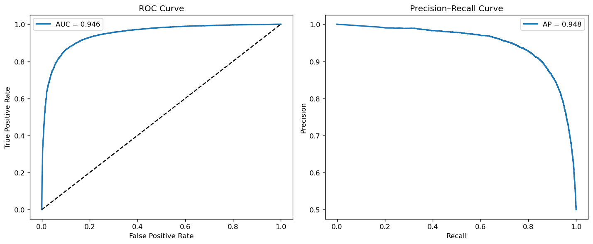
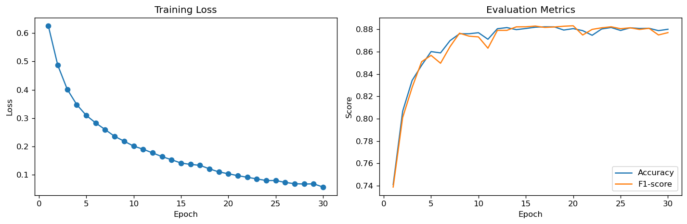

# SENT_EMO: Gated CNN for Sentiment Analysis

This repository implements a Gated Convolutional Neural Network (GCNN)
for sentiment classification on the IMDB dataset.

## Project Structure

```text
src/
├── data/           # Dataset loading and preprocessing
├── SEmodels/       # Model architectures
├── SEutils/        # Training, evaluation, metrics
├── train.py        # Training entry point
notebooks/          # Analysis and visualization
```

Dataset

We use the IMDB movie review dataset.
Due to size constraints, the dataset is not included in this repository.

Download it from:
https://ai.stanford.edu/~amaas/data/sentiment/

Place it under:
```
data/aclImdb/
```

## Training
```
python src/train.py
```

## Model

Gated CNN with embedding and convolutional dropout

Binary sentiment classification

## Evaluation

Accuracy

Precision / Recall / F1

ROC-AUC / PR-AUC

## 效果对比
<div align="center">
  
  
</div>
